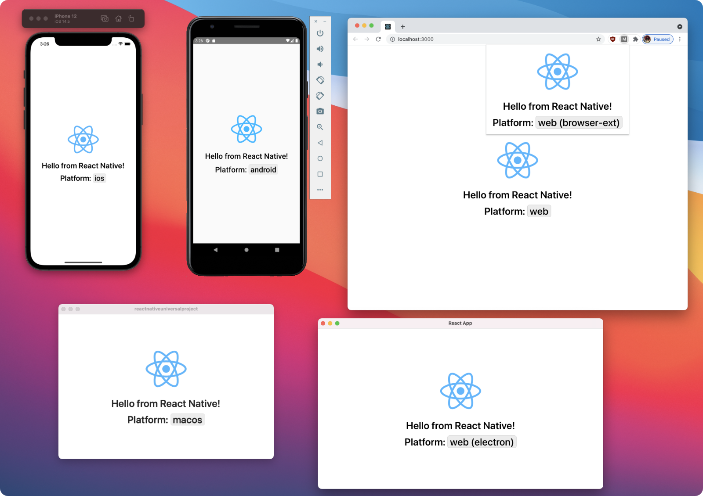

# React Native Universal Monorepo

An opinonated approach to supporting multiple platforms with React Native using a Yarn Workspaces monorepo.  

Check out __[Running React Native everywhere](https://mmazzarolo.com/blog/2021-09-11-running-react-native-everywhere/)__ for an in-depth guide on how and why I recommend trying out this approach if you're planning to support multiple platforms in your app.  
- [Overview](https://mmazzarolo.com/blog/2021-09-11-running-react-native-everywhere/)
- [Yarn Workspaces monorepo setup](https://mmazzarolo.com/blog/2021-09-12-running-react-native-everywhere-monorepo/)
- [Android & iOS](https://mmazzarolo.com/blog/2021-09-18-running-react-native-everywhere-mobile/)
- [Windows & macOS](https://mmazzarolo.com/blog/2021-09-19-running-react-native-everywhere-windows-macos/)
- [The Web](https://mmazzarolo.com/blog/2021-09-22-running-react-native-everywhere-web/)
- [Browser Extensions & Electron](https://mmazzarolo.com/blog/2021-09-25-running-react-native-everywhere-electron-browser-ext/)

&nbsp;

<p align="center" margin-bottom="0">
  
</p>

## Overview

This monorepo uses [Yarn workspaces](https://classic.yarnpkg.com/en/docs/workspaces/) and [TypeScript](https://www.typescriptlang.org/) to support a modular React Native project.  

The core idea is to isolate the JavaScript app code from the platform configurations (native code + the app bundlers like Metro and Webpack).  
This isolation happens by using different [workspaces](https://classic.yarnpkg.com/en/docs/workspaces/): We have an `app` workspace for the JavaScript app code, a `mobile` workspace for the React Native mobile configuration, a `macos` workspace for the React Native macOS configuration, and so on.  

We fully embrace [Yarn `nohoist`](https://classic.yarnpkg.com/blog/2018/02/15/nohoist/) to allow using different versions of React Native on each platform (which is recommended but not required), simplifying the adoption of new React Native updates.  
Thanks nohoist, each platform workspace (`mobile`, `macos`, etc.) can depend on any React Native version, regardless of what version the other platform workspaces are using. 
For example, we can use `react-native@0.65` on the mobile app and `react-native@0.63` on the macOS app — as long as the JavaScript app code supports both versions.  
This approach promotes gradual React Native updates over updates in lockstep.  

For more details, check out ["Running React Native everywhere: Yarn Workspaces monorepo setup"](https://mmazzarolo.com/blog/2021-09-12-running-react-native-everywhere-monorepo/).  

> ⚠️ Please notice that I'm not saying this is the _right_ way to do React Native monorepos. This is just an approach that I enjoy using on larger codebases :)

## Supported platforms

- Android (React Native 0.65)
- iOS (React Native 0.65)
- Windows (React Native 0.65)
- MacOS (React Native 0.63)
- Android TV (React Native 0.65)
- tvOS (React Native 0.65)
- Web (React Native 0.65)
- Web - Browser Extension (React Native 0.65)
- Web - Electron (React Native 0.65)
- Web - Next.js (React Native 0.65)

## Getting started

You can use this repo as a boilerplate, removing the workspaces of platforms that you don't need, or you can create this setup from scratch if you want to fully understand how it works. 

### Using this repository as a boilerplate

1. Clone the repository: `git@github.com:mmazzarolo/react-native-universal-monorepo.git`
2. Run yarn install `cd react-native-universal-monorepo && yarn` 

### Create this setup from scratch

Step by step tutorial on creating this repository from scratch: 

- [Overview](https://mmazzarolo.com/blog/2021-09-11-running-react-native-everywhere/)
- [Yarn Workspaces monorepo setup](https://mmazzarolo.com/blog/2021-09-12-running-react-native-everywhere-monorepo/)
- [Android & iOS](https://mmazzarolo.com/blog/2021-09-18-running-react-native-everywhere-mobile/)
- [Windows & macOS](https://mmazzarolo.com/blog/2021-09-19-running-react-native-everywhere-windows-macos/)
- [The Web](https://mmazzarolo.com/blog/2021-09-22-running-react-native-everywhere-web/)
- [Browser Extensions & Electron](https://mmazzarolo.com/blog/2021-09-25-running-react-native-everywhere-electron-browser-ext/)

Tutorial for the TV and Next.js platforms from [@thefinnomenon](https://github.com/thefinnomenon):  
- [Adding tvOS & Android TV Support to Monorepo](https://finnternet.com/dev/blog/react-native-tv-monorepo)
- [Next.js in React-Native Monorepo](https://finnternet.com/dev/blog/nextjs-monorepo)

Additional resources:  
- [Run your React Native app on the web with React Native for Web
](https://mmazzarolo.com/blog/2020-10-24-adding-react-native-web/)
- [Building a desktop application using Electron and Create React App](https://mmazzarolo.com/blog/2021-08-12-building-an-electron-application-using-create-react-app/)
- [Developing a browser extension with Create React App](https://mmazzarolo.com/blog/2019-10-19-browser-extension-development/)

## Available commands

Development and build commands:

- `yarn android:metro`: Start the metro server for Android/iOS
- `yarn android:start`: Start developing the Android app
- `yarn android:studio`: Open the android app on Android Studio
- `yarn ios:metro`: Start the metro server for Android/iOS
- `yarn ios:start`: Start developing the iOS app
- `yarn ios:pods`: Install iOS cocoapods dependencies
- `yarn ios:xcode`: Open the iOS app on XCode
- `yarn macos:metro`: Start the metro server for macOS
- `yarn macos:start`: Start developing the macOS app
- `yarn macos:pods`: Install macOS cocoapods dependencies
- `yarn macos:xcode`: Open the macOS app on XCode
- `yarn web:start`: Start developing the web app
- `yarn web:build`: Create a production build of the web app
- `yarn electron:start`: Start developing the Electron app
- `yarn electron:package:mac`: Package the production binary of the Electron app for macOS
- `yarn electron:package:win`: Package the production binary of the Electron app for windows
- `yarn electron:package:linux`: Package the production binary of the Electron app for linux
- `yarn browser-ext:start`: Start developing the browser extension
- `yarn browser-ext:build`: Create a production build of the browser extension
- `yarn windows:metro`: Start the metro server for Windows
- `yarn windows:start`: Start developing the Windows app
- `yarn tv:android:metro`: Start the metro server for Android TV
- `yarn tv:android:start`: Start developing the Android TV app
- `yarn tv:android:studio`: Open the Android TV app in Android Studio
- `yarn tv:tvos:metro`: Start the metro server for tvOS
- `yarn tv:tvos:start`: Start developing the tvOS app
- `yarn tv:tvos:xcode`: Open the tvOS app in XCode
- `yarn tv:tvos:pods`: Install tvOS cocoapods dependencies
- `yarn next:start`: Start the Next.js app
- `yarn next:build`: Build the Next.js app
- `yarn next:serve`: Serve the Next.js app build

Other commands (we use [ultra-runner](https://github.com/folke/ultra-runner) to run these commands on all workspaces): 

- `yarn lint`: Lint each project
- `yarn lint:fix`: Lint + fix each project
- `yarn test`: Run tests of each project
- `yarn typecheck`: Run the TypeScript type-checking on each project


## Native dependencies

While working on React Native in a monorepo, you'll notice that several packages won't work correctly when hoisted — either because they need to be natively linked or because they end up being bundled twice, breaking the build (e.g., `react`, `react-dom`).  
This is not an issue with the approach used in this project per se. It's more of a common problem with monorepos.  

To fix these issues, [we mark them as nohoist](https://classic.yarnpkg.com/blog/2018/02/15/nohoist/), so they will be installed in each package that depends on them.  

In this monorepo, you can see an example of such libraries in `react-native-async-storage`.  

In the metro bundler and Webpack configs used across the monorepo, [we're using a set of build-tools](https://github.com/mmazzarolo/react-native-monorepo-tools/) to ensure nohoisted packages are resolved correctly.  
So, as long as you add these libraries [to the `nohoist` list](https://github.com/mmazzarolo/react-native-universal-monorepo/blob/a7dcfcbe7c7df66f6d11f06dd13f51ff94b1e70c/package.json#L9-L19), you should be good to go 👍  

## Yarn Classic vs Yarn 2+

We're striving to make this setup compatible with Yarn Classic — but, [with a few tweaks](https://yarnpkg.com/getting-started/migration), it's compatible with Yarn 2+ as well (providing all Yarn 2+ benefits).  
See [#22](https://github.com/mmazzarolo/react-native-universal-monorepo/issues/22) for more info. 

## Setting up Yarn 2+

1. Run `yarn set version berry` at the root of project. It will create a `.yarnrc.yml` file. 
2. Add the following lines to `.yarnrc.yml` to ensure `node_modules` directories are all created in each workspace:
```yml
nodeLinker: node-modules
nmHoistingLimits: workspaces
```
3. `nmHositingLimits` tells how to hoist dependencies for each workspace. By setting it to `workspaces` all dependencies will be installed in each workspace's `node_modules` rather than being hoisted to the root folder. This means you can now you can safely the `noHoist` section in the root's `package.json`. 

Check out [Yarn 2+'s "getting started" guide](https://yarnpkg.com/getting-started/install) for more info.  


## Known issues

In some cases, Yarn Classic won't be able to resolve correctly dependencies that have a `peerDependency` on `react-native`.  
See [#22](https://github.com/mmazzarolo/react-native-universal-monorepo/issues/22) for a few workarounds. A fix on the `react-native-monorepo-tools` repo [is on the work](https://github.com/mmazzarolo/react-native-monorepo-tools/issues/9). 

## Contributing

Contributions, discussions, and feedback are welcome! Please ask if there are any active plans on feature changes before submitting new PRs 👍
